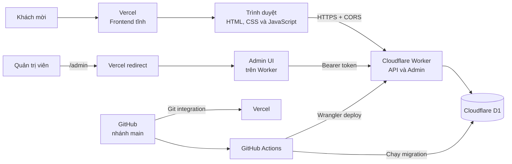
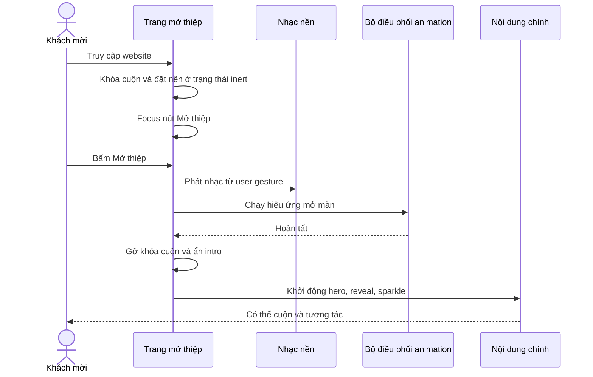
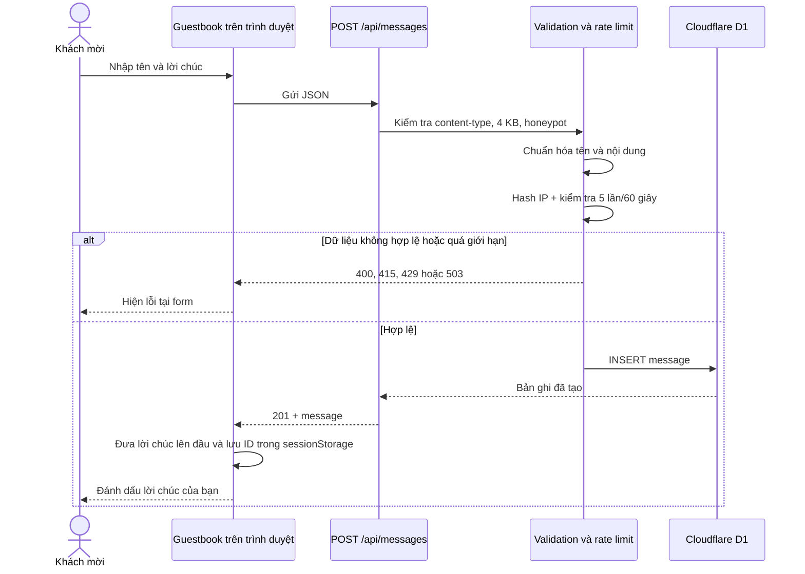
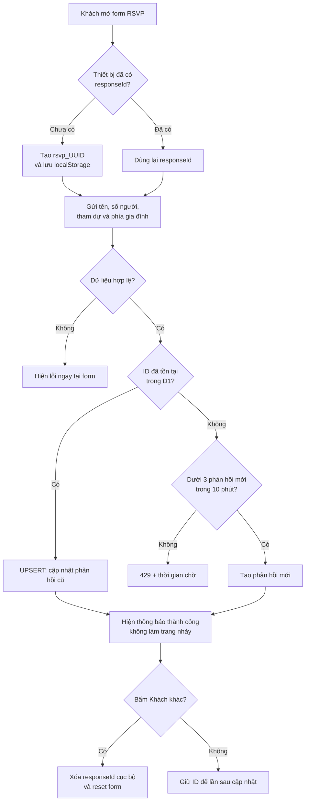
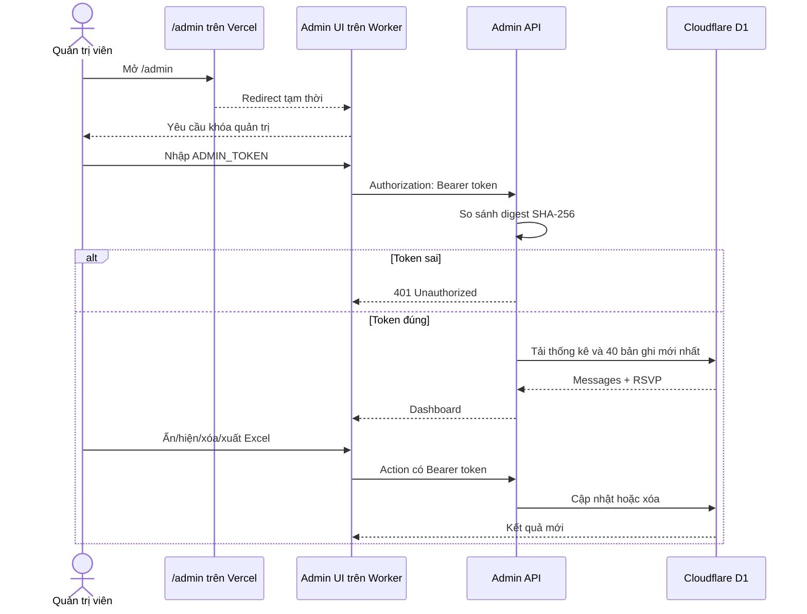
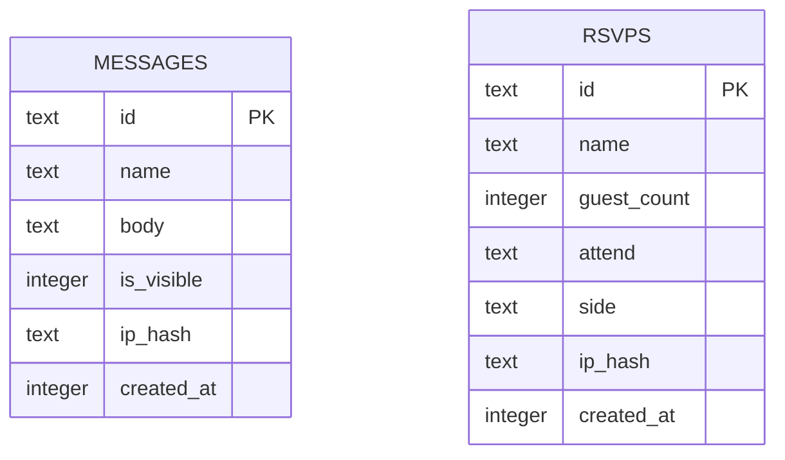
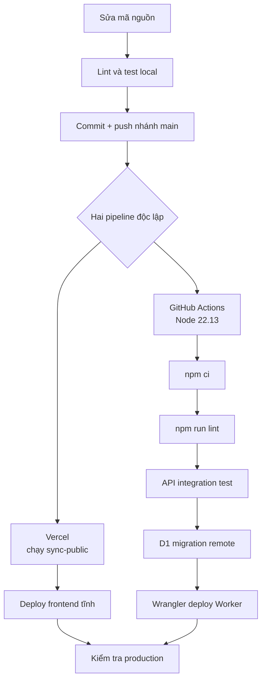

# Tài liệu kỹ thuật và vận hành

## Thiệp cưới Ngô Nam & Nhật Mai

Tài liệu này mô tả cách dự án đã được thiết kế, các công nghệ đang sử dụng,
luồng hoạt động của giao diện và backend, cách chạy cục bộ, triển khai, quản trị,
sao lưu và xử lý sự cố.

Thông tin được đối chiếu với mã nguồn trên nhánh `main`, tại mốc nền
`3abf4ee` ngày 25/07/2026.

### Địa chỉ production

| Thành phần | Địa chỉ |
| --- | --- |
| Thiệp cưới | <https://ngo-nam-nhat-mai-wedding.vercel.app/> |
| Trang quản trị | <https://ngo-nam-nhat-mai-wedding.vercel.app/admin> |
| Backend API | <https://ngo-nam-nhat-mai-wedding-api.vanhung71388.workers.dev> |
| Kiểm tra sức khỏe API | <https://ngo-nam-nhat-mai-wedding-api.vanhung71388.workers.dev/api/health> |
| Mã nguồn | <https://github.com/NhatLam71388/WEDDING> |

> Không ghi `ADMIN_TOKEN`, `RATE_LIMIT_SALT` hoặc `CLOUDFLARE_API_TOKEN` thật
> vào mã nguồn, tài liệu, ảnh chụp màn hình hay lịch sử chat.

---

## 1. Tổng quan hệ thống

Website được tách thành hai phần độc lập:

- Frontend tĩnh chạy trên Vercel: giao diện thiệp, hiệu ứng, album, nhạc, bản
  đồ, form lời chúc và form xác nhận tham dự.
- Backend chạy trên Cloudflare Workers: API công khai, trang quản trị và logic
  bảo mật.
- Dữ liệu được lưu trong Cloudflare D1: lời chúc và RSVP.
- Mỗi lần push lên nhánh `main`, Vercel và GitHub Actions tự triển khai theo hai
  pipeline riêng.



Ý nghĩa của cách tách này:

- Vercel chỉ phục vụ file tĩnh nên tải nhanh và không cần giữ kết nối database.
- Worker xử lý API độc lập, nhẹ hơn việc đưa cả ứng dụng React/Vinext vào mỗi
  request.
- D1 nằm cùng hệ sinh thái Cloudflare với Worker, không phải mở database trực
  tiếp ra Internet.
- Frontend và backend có thể triển khai riêng, nhưng thay đổi API phải bảo đảm
  tương thích ngược để tránh lệch phiên bản trong vài phút.

---

## 2. Quy trình đã thực hiện

### Giai đoạn 1 — Chuẩn hóa nội dung thiệp

- Xác định tên cô dâu, chú rể, thời gian và địa chỉ hai gia đình.
- Ưu tiên thời gian nhà gái: 11:00 thứ Sáu, 07/08/2026.
- Bổ sung liên kết chỉ đường cho nhà trai và nhà gái.
- Tách nội dung quan trọng khỏi phần trang trí để vẫn đọc tốt trên điện thoại.

### Giai đoạn 2 — Thiết kế lại UI/UX

- Làm lại màn mở thiệp để tạo điểm nhấn trước khi vào nội dung.
- Điều chỉnh typography theo phong cách thiệp cưới: font serif cho nội dung,
  script/calligraphy cho tên và câu trang trí.
- Sắp xếp chữ vào vùng trống của ảnh để hạn chế che mặt hoặc chủ thể.
- Dùng nhiều kiểu khung ảnh thay vì lặp lại một kiểu bo vòm.
- Chọn một số ảnh nổi bật để kể câu chuyện trên trang chính; toàn bộ ảnh còn
  lại nằm trong album mở rộng.
- Tách hai ảnh ngang dắt tay nhau thành hai khối trên/dưới để ảnh đủ lớn.
- Thêm lightbox để bấm vào ảnh album và xem ảnh đầy đủ, không bị crop.
- Khắc phục thao tác cuộn khi con trỏ nằm trên ảnh.

### Giai đoạn 3 — Chuyển động và tương tác

- Chỉ bắt đầu animation nội dung sau khi người dùng bấm “Mở thiệp”.
- Thêm chuyển động mở màn, ba bồ câu bay, reveal theo vùng nhìn, parallax nhẹ,
  hạt sáng và hiệu ứng trang trí.
- Tôn trọng `prefers-reduced-motion` để giảm chuyển động cho người nhạy cảm.
- Đưa nút nhạc xuống góc trái; nhạc chỉ phát sau thao tác người dùng để phù hợp
  chính sách autoplay của trình duyệt.
- Thêm điều hướng section, đếm ngược, bản đồ tải lười và thao tác album bằng
  bàn phím/swipe.

### Giai đoạn 4 — Tính năng dữ liệu thật

- Xây API gửi và đọc lời chúc.
- Phân trang lời chúc bằng cursor để 100, 1.000 hay nhiều hơn nữa không làm tải
  toàn bộ dữ liệu một lần.
- Sau khi gửi, lời chúc mới xuất hiện ngay và được đánh dấu trên thiết bị đó.
- Xây API RSVP có mã phản hồi riêng; cùng một thiết bị gửi lại sẽ cập nhật phản
  hồi cũ thay vì dựa vào tên.
- Xây trang quản trị để xem thống kê, ẩn/hiện/xóa lời chúc, xóa RSVP và xuất
  Excel.

### Giai đoạn 5 — Hạ tầng và tự động triển khai

- Chuyển backend sang Cloudflare Workers + D1.
- Tạo migration database và Worker production độc lập.
- Giữ frontend trên Vercel.
- Kết nối repository GitHub với Vercel.
- Tạo GitHub Actions để lint, test, migrate D1 và deploy Worker khi push
  `main`.
- Kiểm tra production, CORS, xác thực quản trị và dữ liệu D1.

### Giai đoạn 6 — Kiểm thử và tối ưu

- Tạo WebP 640 px và 1280 px để trình duyệt chọn kích thước phù hợp.
- Dùng lazy loading cho ảnh/bản đồ không nằm ở màn hình đầu.
- Viết test cho mở thiệp, cuộn, album, form, nội dung cưới, tọa độ, frontend
  Vercel và API thật chạy với Miniflare + D1.
- Kiểm tra giới hạn request, rate limit, phân trang, xác thực quản trị và
  moderation.

---

## 3. Công nghệ sử dụng

| Lớp | Công nghệ | Vai trò |
| --- | --- | --- |
| Giao diện production | HTML5, CSS3, JavaScript | Thiệp tĩnh, responsive và animation |
| Component runtime trong thiệp | React 18.3.1, ReactDOM 18.3.1 | Form, album và trạng thái tương tác |
| Runtime hỗ trợ | Babel Standalone 7.29 | Biên dịch component khai báo trong trang |
| Toolchain ứng dụng | React 19, Next.js 16, Vinext, Vite | Dev/build và các route dùng chung |
| Font | Playfair Display, Cormorant Garamond, Great Vibes, Dancing Script, Be Vietnam Pro | Phân cấp chữ cưới và chữ nội dung |
| Backend production | Cloudflare Workers | Router HTTP, API, admin và security headers |
| Database | Cloudflare D1 (SQLite) | Lưu lời chúc và RSVP |
| ORM/schema | Drizzle ORM, Drizzle Kit | Định nghĩa schema và sinh migration |
| Frontend hosting | Vercel | Phục vụ frontend tĩnh và redirect `/admin` |
| Backend deploy | Wrangler | Migration D1, secrets và deploy Worker |
| CI/CD | GitHub Actions | Lint, test, migrate và deploy tự động |
| Test | Node Test Runner, Miniflare | Unit/regression/integration với Worker + D1 |
| Ảnh | WebP, `srcset`, lazy loading | Tối ưu dung lượng và độ nét theo thiết bị |

### Hai runtime dễ bị nhầm

- Production frontend của Vercel lấy trực tiếp
  `Thiep Cuoi 57 v2.dc.html`, `support.js`, `image-slot.js` và `assets/`.
- Production backend lấy `worker/api.ts` làm entry theo
  `wrangler.api.jsonc`.
- Các file `app/`, `worker/index.ts`, `vite.config.ts` và
  `.openai/hosting.json` vẫn hỗ trợ toolchain Vinext/Sites và tái sử dụng route,
  nhưng không phải entry của Worker production hiện tại.

Không sửa trực tiếp `.site-public/`. Đây là thư mục sinh tự động và sẽ bị
`scripts/sync-public.mjs` xóa rồi tạo lại.

---

## 4. Cấu trúc repository

```text
.
├── .github/workflows/
│   └── deploy-cloudflare.yml    # CI/CD backend
├── app/
│   ├── api/                     # Route handlers dùng lại bởi Worker
│   └── admin/                   # Admin React của toolchain đầy đủ
├── assets/
│   ├── audio/                   # Nhạc nền
│   └── photos/                  # Ảnh WebP 640/1280
├── db/
│   ├── index.ts                 # Query và thao tác D1
│   └── schema.ts                # Schema Drizzle
├── docs/
│   └── TECHNICAL-HANDBOOK.md    # Tài liệu này
├── drizzle/
│   └── 0000_....sql             # Migration D1
├── lib/
│   ├── admin-auth.ts            # Bearer-token auth
│   ├── public-api-cors.ts       # Allowlist CORS
│   ├── security.ts              # Body limit, IP hash, response helpers
│   └── validation.ts            # Chuẩn hóa và kiểm tra input
├── scripts/
│   └── sync-public.mjs          # Chuẩn bị output tĩnh cho Vercel
├── tests/                       # Regression và API integration tests
├── worker/
│   ├── admin-page.ts            # Admin HTML nhẹ
│   └── api.ts                   # Entry Cloudflare Worker production
├── Thiep Cuoi 57 v2.dc.html     # Trang thiệp chính
├── support.js                   # Runtime giao diện
├── image-slot.js                # Hỗ trợ ảnh
├── vercel.json                  # Cấu hình frontend Vercel
└── wrangler.api.jsonc           # Cấu hình Worker + D1
```

Thư mục `30 file ảnh lẻ/` chứa ảnh nguồn độ phân giải cao và được
`.gitignore` bỏ qua. Chỉ ảnh tối ưu cần dùng trên web mới được đưa vào
`assets/photos/`.

---

## 5. Luồng giao diện khi mở thiệp



Điểm quan trọng:

- Animation nội dung không được chạy trước khi intro kết thúc.
- Intro dùng ảnh riêng đã mở rộng cho màn hình dọc qua thẻ `picture`, thay vì
  zoom ảnh desktop để lấp đầy điện thoại.
- Nếu Web Animations API không có, giao diện có fallback để vẫn mở được.
- Nếu người dùng bật giảm chuyển động, hiệu ứng được rút ngắn hoặc tắt.
- Nhạc không tự phát trước thao tác đầu tiên vì trình duyệt thường chặn autoplay.
- Cuộn dùng listener thụ động; ảnh không chặn wheel/touch của trang.

### Nội dung chính sau khi mở

1. Hero và thông tin ngày cưới.
2. Giới thiệu cô dâu/chú rể bằng hai ảnh riêng.
3. Khối váy xoay “nàng công chúa”.
4. Hai ảnh ngang dắt tay nhau, mỗi ảnh chiếm một hàng.
5. Thông tin hai gia đình, thời gian và chỉ đường.
6. Countdown.
7. Album chọn lọc và nút xem toàn bộ.
8. Form RSVP.
9. Guestbook/lời chúc.
10. Thông tin mừng cưới và kết trang.

### Album

- Trang chính chỉ trình bày các ảnh nổi bật để không làm khách phải cuộn quá
  lâu.
- Album đầy đủ hiện 30 ảnh theo lưới.
- Bấm một ảnh sẽ mở lightbox dùng bản 1280 px và `object-fit: contain`, vì vậy
  xem được toàn ảnh.
- Lightbox hỗ trợ nút trước/sau, phím mũi tên, `Esc`, swipe và quản lý focus.
- Các tile ngang được đánh dấu riêng để masonry/grid không tạo khoảng trống
  bất thường.

---

## 6. Luồng lời chúc



### Khi có hơn 100 lời chúc

- API không trả tất cả một lần.
- Lần đầu frontend lấy 12 lời chúc mới nhất.
- Nút “Xem thêm” dùng cursor để lấy trang kế tiếp.
- Cursor chứa cặp `created_at + id`, giúp phân trang ổn định khi có lời chúc mới.
- Mỗi request tối đa 24 mục.
- Frontend tự làm mới khi tab hoạt động lại và mỗi 30 giây.
- Sau khi gửi thành công, lời chúc của khách được chèn ngay nên họ không phải
  tìm ở cuối danh sách.

### Quy tắc dữ liệu lời chúc

- Tên: 1–60 ký tự.
- Nội dung: 1–400 ký tự.
- Request body tối đa 4.096 byte.
- Tối đa 5 lời chúc trên một IP hash trong 60 giây.
- Chỉ lời chúc có `is_visible = 1` xuất hiện ở API công khai.
- IP thật không được lưu; hệ thống chỉ lưu SHA-256 hash đã thêm salt.

---

## 7. Luồng xác nhận tham dự RSVP



### Vì sao không dùng họ tên làm khóa

Tên người dùng không duy nhất. Hai người có thể trùng tên, hoặc một người có
thể sửa cách viết tên. Hệ thống dùng `responseId` dạng `rsvp_<UUID>` làm định
danh:

- Cùng thiết bị và cùng ID: cập nhật bản ghi cũ.
- Hai ID khác nhau nhưng cùng tên: vẫn là hai phản hồi riêng.
- “Khách khác”: xóa ID cục bộ để tạo một phản hồi mới.

`responseId` là mã chỉnh sửa mức rủi ro thấp, không phải tài khoản đăng nhập.
Người biết mã này có thể cập nhật RSVP tương ứng.

### Quy tắc RSVP

- Tên: 1–60 ký tự.
- `attend`: `yes` hoặc `no`.
- `side`: `groom` hoặc `bride`.
- Nếu tham dự: số khách từ 1 đến 20.
- Nếu không tham dự: hệ thống lưu số khách bằng 0.
- Bản ghi mới: tối đa 3 phản hồi/IP hash trong 10 phút.
- Cập nhật một `responseId` đã tồn tại không tạo bản ghi trùng và không bị chặn
  bởi quota tạo mới.

---

## 8. Luồng quản trị



Admin UI hỗ trợ:

- Thống kê tổng lời chúc, đang hiện và đang ẩn.
- Thống kê RSVP, có/không tham dự, tổng số khách và phía gia đình.
- Biểu đồ tỷ lệ tham dự, phân bổ khách hai gia đình và trạng thái lời chúc.
- Hiện 40 lời chúc và 40 RSVP gần nhất.
- Tìm kiếm và lọc danh sách theo tên, trạng thái và phía gia đình.
- Ẩn/hiện hoặc xóa lời chúc.
- Xóa RSVP.
- Xuất tối đa 250 dòng gần nhất thành file Excel `.xlsx` có tiêu đề, độ rộng cột,
  xuống dòng, bộ lọc và hàng đầu được cố định.
- Dữ liệu do khách nhập được lưu dưới dạng text trong workbook, không chạy như
  công thức Excel.

Token quản trị chỉ được giữ trong bộ nhớ của tab hiện tại. Trang không lưu token
vào `localStorage` hoặc `sessionStorage`. Refresh/tab mới sẽ yêu cầu nhập lại.

> Xóa trong admin là xóa vĩnh viễn khỏi D1. Hãy xuất backup trước khi xóa hàng
> loạt hoặc thay đổi schema.

---

## 9. API reference

### Route công khai

| Method | Route | Chức năng | Auth | Giới hạn chính |
| --- | --- | --- | --- | --- |
| `GET` | `/` | Health response cơ bản | Không | — |
| `GET` | `/api/health` | Kiểm tra Worker | Không | — |
| `GET` | `/api/messages` | Lấy lời chúc đang hiện | Không | Mặc định 12, tối đa 24 |
| `POST` | `/api/messages` | Gửi lời chúc | Không | 5/IP hash/60 giây |
| `POST` | `/api/rsvp` | Tạo/cập nhật RSVP | Không | 3 bản ghi mới/IP hash/10 phút |

### Route quản trị

| Method | Route | Chức năng | Auth |
| --- | --- | --- | --- |
| `GET` | `/admin` | Admin UI nhẹ | Form token trong UI |
| `GET` | `/api/admin/dashboard` | Thống kê và dữ liệu gần nhất | Bearer token |
| `POST` | `/api/admin/dashboard` | Ẩn/hiện/xóa dữ liệu | Bearer token |
| `GET` | `/api/admin/export?type=messages&format=xlsx` | Xuất lời chúc Excel | Bearer token |
| `GET` | `/api/admin/export?type=rsvps&format=xlsx` | Xuất RSVP Excel | Bearer token |

Không truyền `format` hoặc dùng `format=csv` sẽ trả file CSV tương thích cũ.
Dashboard production cho phép chọn Excel hoặc CSV. CSV giữ giới hạn 10.000
dòng; XLSX giới hạn 250 dòng gần nhất để phù hợp ngân sách CPU của Worker Free.

Các route API hỗ trợ `OPTIONS` khi cần CORS. Method không phù hợp trả `405` kèm
header `Allow`; route không tồn tại trả JSON `404`.

### Ví dụ gửi lời chúc

```json
{
  "name": "Nguyễn Văn A",
  "body": "Chúc hai bạn trăm năm hạnh phúc!",
  "website": ""
}
```

Response thành công:

```json
{
  "success": true,
  "message": {
    "id": "uuid",
    "name": "Nguyễn Văn A",
    "body": "Chúc hai bạn trăm năm hạnh phúc!",
    "createdAt": "2026-07-25T10:00:00.000Z"
  }
}
```

### Ví dụ gửi RSVP

```json
{
  "responseId": "rsvp_00000000-0000-4000-8000-000000000000",
  "name": "Nguyễn Văn A",
  "count": 2,
  "attend": "yes",
  "side": "bride",
  "website": ""
}
```

### Status code thường gặp

| Code | Ý nghĩa |
| --- | --- |
| `200` | Đọc/cập nhật thành công |
| `201` | Tạo hoặc upsert thành công |
| `204` | CORS preflight thành công |
| `400` | Dữ liệu hoặc cursor không hợp lệ |
| `401` | Thiếu/sai admin token |
| `403` | Origin không có trong CORS allowlist |
| `404` | Không tìm thấy route hoặc bản ghi |
| `405` | Sai HTTP method |
| `413` | Body vượt giới hạn |
| `415` | Content-Type không phải JSON |
| `429` | Quá rate limit |
| `503` | Thiếu secret, binding D1 hoặc lỗi dịch vụ |

---

## 10. Mô hình dữ liệu

Hai bảng độc lập, không có foreign key:



### Bảng `messages`

- Primary key: UUID.
- `is_visible` mặc định true.
- Index `(is_visible, created_at)` phục vụ danh sách công khai.
- Index `(ip_hash, created_at)` phục vụ rate limit.
- Check constraint kiểm tra độ dài tên, nội dung và hash.

### Bảng `rsvps`

- Primary key: UUID thường hoặc ID có prefix `rsvp_`.
- Index `(ip_hash, created_at)` phục vụ rate limit.
- Index `created_at` phục vụ dashboard/export.
- Check constraint kiểm tra số khách và enum `attend`/`side`.
- Khi upsert, `created_at` được cập nhật và đang đóng vai trò thời gian thay đổi
  gần nhất.

Migration hiện tại:

```text
drizzle/0000_conscious_the_fallen.sql
```

---

## 11. Bảo mật

### Secret và token

| Secret | Nơi lưu | Mục đích |
| --- | --- | --- |
| `ADMIN_TOKEN` | Cloudflare Worker secret + password manager của chủ dự án | Đăng nhập admin |
| `RATE_LIMIT_SALT` | Cloudflare Worker secret + password manager | Salt khi hash IP |
| `CLOUDFLARE_API_TOKEN` | GitHub Actions secret | Cho CI migrate D1 và deploy Worker |

Ba giá trị này độc lập. `CLOUDFLARE_API_TOKEN` không phải khóa đăng nhập admin.
Cloudflare Account ID và D1 database ID là định danh cấu hình, không phải secret.

### Các lớp bảo vệ đang có

- Bearer token cho API quản trị.
- Token được hash SHA-256 trước khi so sánh digest có kích thước cố định.
- CORS dùng danh sách origin chính xác, không dùng `*`.
- Honeypot chống bot cơ bản.
- Giới hạn request body và kiểm tra Content-Type.
- Chuẩn hóa Unicode, khoảng trắng và loại control character.
- Rate limit dùng câu lệnh D1 nguyên tử.
- Không lưu IP thô.
- API/admin dùng `Cache-Control: no-store`.
- Admin có CSP, `noindex` và không lưu token trong browser storage.
- Response có `nosniff`, `SAMEORIGIN`, Referrer Policy và Permissions Policy.

### Hạn chế cần biết

- Chưa có CAPTCHA; honeypot + rate limit là lớp chống spam hiện tại.
- Admin chỉ có một secret chung, chưa có nhiều tài khoản hoặc audit log.
- Ai biết `responseId` RSVP có thể cập nhật phản hồi đó.
- CORS exact-origin nghĩa là domain/preview mới sẽ bị chặn cho đến khi thêm vào
  allowlist.

---

## 12. Chạy dự án cục bộ

### Yêu cầu

- Node.js `22.13.0` trở lên.
- npm.
- Wrangler chỉ cần đăng nhập Cloudflare khi làm việc với tài nguyên remote.

### Cài đặt

```bash
npm ci
```

### Chạy giao diện/toolchain

```bash
npm run dev
```

Lệnh `predev` sẽ chạy `scripts/sync-public.mjs` để tạo `.site-public/`, sau đó
Vinext/Vite khởi động server. Mở URL được in trong terminal.

Mở thẳng file HTML chỉ phù hợp kiểm tra giao diện tĩnh. Chat và RSVP cần API.

### Chạy Worker + D1 local

Tạo `.dev.vars` từ `.env.example`, sau đó thay bằng hai giá trị local riêng:

```dotenv
ADMIN_TOKEN=local-admin-token-long-and-random
RATE_LIMIT_SALT=local-rate-limit-salt-long-and-random
```

Không commit `.dev.vars`.

Khởi tạo schema D1 local:

```bash
npm run db:migrate:local
```

Chạy Worker:

```bash
npm run api:dev
```

Sau đó dùng địa chỉ Wrangler in ra để gọi `/api/health`, `/api/messages` hoặc
`/admin`.

### Các lệnh thường dùng

| Lệnh | Tác dụng |
| --- | --- |
| `npm run sync:public` | Tạo output frontend tĩnh |
| `npm run dev` | Chạy môi trường phát triển |
| `npm run build` | Build ứng dụng/toolchain |
| `npm run lint` | Kiểm tra ESLint |
| `npm test` | Build rồi chạy toàn bộ test |
| `npm run db:generate` | Sinh migration từ schema Drizzle |
| `npm run db:migrate:local` | Áp migration vào D1 local |
| `npm run db:migrate:remote` | Áp migration vào D1 production |
| `npm run deploy:worker` | Deploy Worker production |
| `npm run deploy:cloudflare` | Migrate D1 rồi deploy Worker |

---

## 13. Hướng dẫn sử dụng

### Đối với khách mời

1. Truy cập URL thiệp.
2. Bấm “Mở thiệp”; thao tác này đồng thời cho phép trình duyệt phát nhạc.
3. Cuộn để xem nội dung, bản đồ và album.
4. Bấm ảnh trong album để xem toàn màn hình; dùng `Esc` để đóng.
5. Điền RSVP. Lần gửi sau trên cùng trình duyệt sẽ cập nhật phản hồi trước.
6. Nếu muốn nhập cho người khác, bấm “Khách khác”.
7. Gửi lời chúc; lời chúc vừa gửi xuất hiện ngay và được đánh dấu.

### Đối với quản trị viên

1. Mở <https://ngo-nam-nhat-mai-wedding.vercel.app/admin>.
2. Nhập `ADMIN_TOKEN` đã lưu trong password manager.
3. Theo dõi thống kê.
4. Ẩn lời chúc không phù hợp trước; chỉ xóa khi chắc chắn.
5. Xuất Excel định kỳ.
6. Logout hoặc đóng tab sau khi sử dụng trên máy lạ.

### Tự tạo khóa quản trị

Khóa quản trị không được Cloudflare “cấp sẵn”. Chủ dự án tự tạo một chuỗi ngẫu
nhiên mạnh, lưu lại, rồi đặt chuỗi đó làm Worker secret.

Tạo bằng Node.js:

```bash
node -e "console.log(require('crypto').randomBytes(32).toString('base64url'))"
```

Lưu kết quả vào password manager, sau đó chạy:

```bash
npx wrangler secret put ADMIN_TOKEN --config wrangler.api.jsonc
```

Nhập khóa vừa tạo khi Wrangler hỏi. Làm tương tự cho salt:

```bash
npx wrangler secret put RATE_LIMIT_SALT --config wrangler.api.jsonc
```

Cloudflare không cho xem lại secret sau khi lưu. Nếu quên `ADMIN_TOKEN`, hãy tạo
khóa mới, chạy lại `wrangler secret put`, rồi dùng khóa mới. Không cần và không
thể khôi phục giá trị cũ.

---

## 14. CI/CD và triển khai production



### Frontend Vercel

Vercel đã được kết nối trực tiếp với GitHub:

1. Push `main`.
2. Vercel chạy `node scripts/sync-public.mjs`.
3. Vercel publish `.site-public`.
4. `/` và `/invitation` được rewrite đến `invitation.html`.
5. `/admin` redirect sang Worker.

Không cần chạy `vercel deploy` thủ công cho mỗi thay đổi.

### Backend Cloudflare

Workflow `.github/workflows/deploy-cloudflare.yml`:

1. Checkout.
2. Dùng Node 22.13.
3. Kiểm tra GitHub secret `CLOUDFLARE_API_TOKEN`.
4. `npm ci`.
5. Lint.
6. Chạy API integration, admin UI regression và deploy contract test.
7. Áp D1 migration.
8. Deploy Worker.

GitHub repository cần Actions secret:

```text
CLOUDFLARE_API_TOKEN
```

Token này cần quyền Workers Scripts Edit và D1 Edit, giới hạn đúng Cloudflare
account của dự án.

> Workflow hiện tại sẽ báo notice và bỏ qua hai bước Cloudflare nếu secret bị
> thiếu; job lint/test vẫn có thể xanh. Khi kiểm tra deploy, phải mở log và xác
> nhận hai bước “Apply D1 migrations” và “Deploy Worker” thực sự đã chạy.

### Deploy thủ công khi cần

```bash
npm ci
npm run lint
node --test tests/api.integration.test.mjs
npm run db:migrate:remote
npm run deploy:worker
```

### Thứ tự khi thay đổi API không tương thích

Vercel và Cloudflare triển khai song song, không bảo đảm cái nào xong trước.
Nên dùng chiến lược:

1. Mở rộng backend để chấp nhận cả payload cũ và mới.
2. Deploy backend.
3. Cập nhật và deploy frontend.
4. Chỉ xóa hành vi cũ ở một lần deploy sau.

Với database, dùng chiến lược **expand → migrate → contract**. Không xóa/đổi
tên cột trong cùng lần deploy với code phụ thuộc vào schema mới.

---

## 15. CORS và thay đổi domain

Frontend production gọi trực tiếp Worker. Origin được allowlist tại:

```text
lib/public-api-cors.ts
worker/api.ts
```

Khi thêm custom domain hoặc muốn preview Vercel gửi dữ liệu:

1. Thêm origin đầy đủ, ví dụ `https://thiep.example.com`, vào public allowlist.
2. Thêm cùng origin vào admin allowlist nếu domain đó cần gọi admin API.
3. Không thêm dấu `/` ở cuối origin.
4. Chạy integration test.
5. Deploy Worker.
6. Kiểm tra preflight và POST thật từ domain mới.

Preview/custom domain không có trong allowlist sẽ nhận `403`. Nếu cho phép một
preview gọi API production, dữ liệu preview cũng sẽ ghi vào D1 production.

---

## 16. Kiểm thử

Chạy kiểm tra nhanh:

```bash
npm run lint
node --test tests/api.integration.test.mjs
```

Chạy toàn bộ:

```bash
npm test
```

Các nhóm test hiện có:

- Build/sync frontend tĩnh.
- Hợp đồng deploy Cloudflare.
- Màn mở thiệp và thời điểm chạy animation.
- Cuộn trên ảnh.
- Các section ảnh nổi bật.
- Album, lightbox và layout regression.
- Form RSVP/lời chúc.
- Nội dung ngày cưới.
- Tọa độ bản đồ.
- Cấu hình frontend Vercel.
- API integration với Miniflare + D1.
- Pagination, CORS, validation, rate limit, RSVP upsert, admin auth,
  moderation, delete và Excel/CSV export.

Checklist kiểm tra thủ công sau deploy:

- Mở thiệp trên desktop và điện thoại.
- Nút mở hoạt động; nội dung chưa chạy animation trước khi bấm.
- Nhạc phát/tạm dừng được.
- Cuộn được khi con trỏ nằm trên ảnh.
- Ảnh hero không zoom/crop sai trên mobile.
- Bấm album xem được ảnh đầy đủ.
- Hai nút chỉ đường mở đúng địa điểm.
- Gửi một RSVP test và cập nhật lại cùng thiết bị.
- Gửi một lời chúc test và thấy ngay trên danh sách.
- Đăng nhập admin, ẩn/hiện lời chúc test, rồi xóa dữ liệu test.
- Mở GitHub Actions và Vercel để xác nhận đúng commit production.

---

## 17. Sao lưu và khôi phục

### Sao lưu D1

File Excel/CSV từ admin chỉ dùng cho báo cáo, không phải bản backup đầy đủ
database.

Từ thư mục dự án, có thể export D1 production ra ngoài repository:

```powershell
$stamp = Get-Date -Format "yyyy-MM-dd-HHmm"
npx wrangler d1 export DB --remote --config wrangler.api.jsonc --output "..\wedding-d1-$stamp.sql"
```

File backup có tên khách và lời chúc, vì vậy cần lưu ở nơi riêng tư, mã hóa và
không commit vào Git.

Khuyến nghị:

- Backup trước mỗi migration quan trọng.
- Backup định kỳ trong thời gian thiệp đang được sử dụng nhiều.
- Thử khôi phục vào một D1 database tạm, không thử trực tiếp trên production.
- Lưu `ADMIN_TOKEN` và `RATE_LIMIT_SALT` trong password manager độc lập.

### Rollback Worker

Xem lịch sử version:

```bash
npx wrangler deployments list --config wrangler.api.jsonc
```

Xem version đang chạy:

```bash
npx wrangler deployments status --config wrangler.api.jsonc
```

Rollback code Worker:

```bash
npx wrangler rollback <VERSION_ID> --config wrangler.api.jsonc
```

Rollback Worker không rollback D1. Nếu migration đã thay đổi dữ liệu/schema,
phải viết migration sửa tiến về phía trước hoặc khôi phục một database riêng từ
backup đã kiểm chứng.

### Rollback frontend

- Cách ưu tiên: `git revert` commit lỗi rồi push `main`.
- Hoặc promote lại deployment trước trong Vercel Dashboard khi cần xử lý nhanh.
- Sau rollback phải kiểm tra frontend cũ còn tương thích với API hiện tại.

---

## 18. Thay đổi nội dung, ảnh và nhạc

### Thay thông tin cưới

Thông tin hiển thị chính nằm trong:

```text
Thiep Cuoi 57 v2.dc.html
```

Sau khi sửa tên, ngày, địa chỉ hoặc tọa độ:

1. Tìm toàn bộ giá trị cũ để tránh sót ở hero, countdown và bản đồ.
2. Kiểm tra timezone của countdown là `+07:00`.
3. Chạy test nội dung và tọa độ.
4. Kiểm tra lại trên desktop/mobile.

### Thêm ảnh

1. Giữ ảnh gốc trong `30 file ảnh lẻ/`.
2. Tạo hai bản WebP trong `assets/photos/`:
   - `<ten>-640.webp`
   - `<ten>-1280.webp`
3. Thêm ID ảnh vào danh sách album trong file thiệp.
4. Nếu là ảnh ngang, cập nhật tập ảnh ngang/wide tile tương ứng.
5. Dùng `srcset` để browser tự chọn bản 640 hoặc 1280.
6. Chạy gallery regression test.

Không đưa tất cả ảnh lên trang chính. Chỉ chọn ảnh tạo nhịp kể chuyện; ảnh còn
lại để trong album đầy đủ.

### Đổi nhạc

File mặc định:

```text
assets/audio/nhac.mp3
```

Có thể thay file nhưng giữ nguyên tên để không phải sửa code. Kiểm tra:

- Dung lượng và thời gian tải trên 4G.
- Khả năng lặp.
- Nút play/pause.
- Quyền sử dụng bản ghi âm trước khi public.

---

## 19. Xử lý sự cố

### Gửi lời chúc/RSVP nhận `503`

Kiểm tra:

1. Worker có binding `DB`.
2. D1 migration đã chạy.
3. `RATE_LIMIT_SALT` đã được đặt.
4. Log Worker trong Cloudflare.

### Admin nhận `401`

- Token sai hoặc bị thừa khoảng trắng.
- Đang nhập `CLOUDFLARE_API_TOKEN` thay vì `ADMIN_TOKEN`.
- Nếu quên khóa, tạo khóa mới và chạy `wrangler secret put ADMIN_TOKEN`.

### Admin nhận `503`

Worker chưa có `ADMIN_TOKEN`. Đặt lại secret và thử lại.

### Trình duyệt báo lỗi CORS hoặc preflight `403`

- Kiểm tra origin hiện tại có đúng trong allowlist.
- Scheme, subdomain và port đều là một phần của origin.
- Deploy Worker sau khi sửa allowlist.

### GitHub Actions xanh nhưng backend không đổi

Mở log workflow. Nếu hai bước migration/deploy có trạng thái skipped thì
`CLOUDFLARE_API_TOKEN` đang thiếu. Thêm lại repository secret rồi chạy
`workflow_dispatch` hoặc push commit mới.

### Lời chúc vừa gửi không thấy

- Nếu POST trả `201`, frontend sẽ chèn ngay vào đầu danh sách.
- Thử chuyển tab rồi quay lại để kích hoạt refresh.
- Kiểm tra lời chúc có bị admin ẩn.
- Kiểm tra request trong DevTools Network.

### Có nhiều RSVP trùng tên

Đây không nhất thiết là lỗi vì tên không phải khóa duy nhất. Đối chiếu ID và
thời gian. Cùng trình duyệt phải dùng lại `responseId`; nút “Khách khác” cố ý
tạo một ID mới.

### Album có khoảng trống

- Kiểm tra ảnh ngang đã được khai báo trong danh sách landscape/wide.
- Kiểm tra file 640 và 1280 tồn tại.
- Kiểm tra kích thước nội tại và `aspect-ratio`.
- Chạy gallery regression test trước khi deploy.

---

## 20. Rủi ro và hướng nâng cấp

Các điểm nên cân nhắc nếu lượng khách hoặc yêu cầu vận hành tăng:

- Làm workflow thất bại ngay khi thiếu `CLOUDFLARE_API_TOKEN`, thay vì skip
  deploy.
- Thêm smoke test production sau deploy.
- Thêm uptime monitoring và cảnh báo lỗi Worker.
- Tự động hóa lịch backup D1 và diễn tập restore.
- Tạo môi trường staging riêng, database riêng và CORS riêng.
- Thêm CAPTCHA nếu xuất hiện spam thực tế.
- Tạo nhiều tài khoản admin hoặc audit log nếu có nhiều người quản trị.
- Chuyển nội dung cưới, danh sách ảnh và URL API sang cấu hình tập trung để giảm
  việc tìm/sửa trực tiếp trong HTML lớn.
- Tách ngày `created_at` và `updated_at` cho RSVP nếu cần báo cáo lịch sử chính
  xác.

---

## 21. Checklist bảo trì ngắn

### Trước khi push

- [ ] Không có secret trong diff.
- [ ] Không sửa trực tiếp `.site-public/`.
- [ ] Ảnh mới có cả bản 640 và 1280.
- [ ] `npm run lint` thành công.
- [ ] Test liên quan thành công.

### Sau khi push

- [ ] Vercel deploy đúng commit.
- [ ] GitHub Actions chạy thật bước migration và Worker deploy.
- [ ] `/api/health` trả `ok: true`.
- [ ] Form lời chúc và RSVP hoạt động.
- [ ] Admin đăng nhập được.
- [ ] Giao diện desktop/mobile không bị crop hoặc khóa cuộn.

### Định kỳ

- [ ] Export backup D1.
- [ ] Xuất Excel báo cáo.
- [ ] Kiểm tra log/error rate.
- [ ] Xóa dữ liệu test.
- [ ] Rà soát quyền GitHub và Cloudflare token.
- [ ] Rotate secret khi có nghi ngờ lộ khóa.
